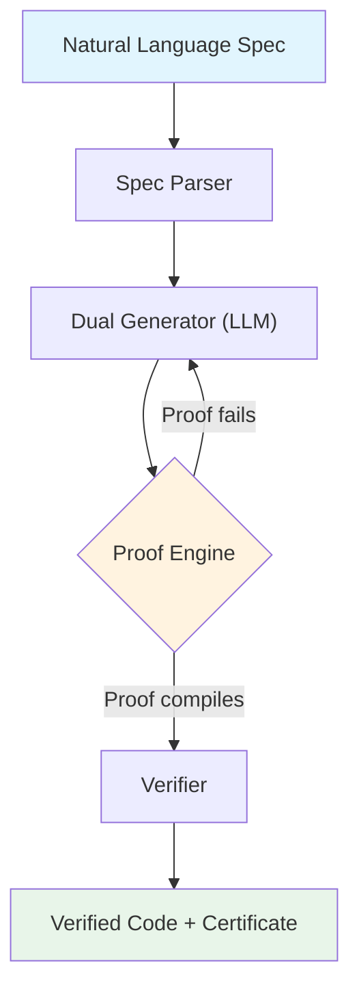

# vericode

[](https://github.com/sushaan-k/vericode/actions/workflows/ci.yml)
[](https://www.python.org/downloads/)
[](LICENSE)
[](https://github.com/astral-sh/ruff)

**Formally verified AI code generation.**

Natural language in. Proven-correct code out.

---

## At a Glance

- Natural-language or YAML specs to implementation plus proof
- Lean 4, Dafny, and Verus backend support
- Iterative proof refinement with backend compiler feedback
- Verifiable certificates binding spec, code, and proof artifacts

## The Problem

AI code generation is everywhere -- Claude Code, Cursor, Copilot -- but none of it comes with guarantees. The industry coined "vibe coding" to describe the workflow: generate code, hope it works, manually test, ship.

The pieces exist separately:

- LLMs can generate code (but with bugs)
- Proof assistants (Lean 4, Dafny, Verus) can verify code (but require expert knowledge)
- DeepSeek-Prover-V2 showed LLMs can generate proofs (but it is a research model, not a tool)

Nobody has connected these into a usable pipeline.

## The Solution

`vericode` is a CLI tool and Python library that takes a natural language specification, generates both implementation code and a formal proof of correctness, and verifies the proof compiles -- all in one command.

```bash
vericode verify "sort a list of integers" --lang python --backend lean4
```

If the proof compiles, the code is **mathematically proven correct** against the spec. This is not testing. This is proof.

## Quick Start

### Install

```bash
pip install vericode
```

### Set your API key

```bash
export ANTHROPIC_API_KEY=sk-ant-...
# or
export OPENAI_API_KEY=sk-...
# or
export DEEPSEEK_API_KEY=sk-...
```

### One-liner API

```python
import asyncio
from vericode import verify

async def main():
    result = await verify(
        "Write a binary search that returns the index of a target "
        "in a sorted array, or -1 if not found.",
        language="python",
        backend="lean4",
    )
    print(result.code)        # The implementation
    print(result.proof)       # The Lean 4 proof
    print(result.verified)    # True if proof compiles
    print(result.iterations)  # Refinement rounds needed
    print(result.certificate) # Machine-verifiable certificate

asyncio.run(main())
```

### Explicit Spec API

```python
from vericode import Spec, verify

spec = Spec(
    description="Merge two sorted lists into one sorted list",
    preconditions=["is_sorted(a)", "is_sorted(b)"],
    postconditions=[
        "is_sorted(result)",
        "len(result) == len(a) + len(b)",
        "is_permutation(result, a + b)",
    ],
)

result = await verify(spec, language="python", backend="dafny", max_iterations=10)
```

### CLI

```bash
# Verify from natural language
vericode verify "sort a list of integers" --lang python --backend lean4

# Verify from a YAML spec file
vericode verify --spec spec.yaml --lang rust --backend verus

# Generate proof for existing code
vericode prove --code sort.py --spec "output is sorted permutation of input"

# Batch verification
vericode batch --specs specs/ --output verified/

# Batch verification with an explicit implementation language override
vericode batch --specs specs/ --output verified/ --backend verus --lang rust
```

`vericode batch` defaults to the backend's native implementation language
(`lean` for Lean 4, `dafny` for Dafny, and `rust` for Verus) unless
`--lang` is provided.

## How It Works

The pipeline has four stages. The key insight is stage 3: an iterative feedback loop between the LLM and the proof assistant that converges on correct code far more reliably than single-shot generation.



### 1. Spec Parser

Converts natural language into a structured `Spec` object with types, preconditions, postconditions, and edge cases.

### 2. Dual Generator

Uses an LLM to generate **both** the implementation and formal proof in a single pass. Generating them together ensures alignment between the code and its proof.

### 3. Proof Engine (Iterative Refinement)

The proof rarely compiles on the first try. The engine runs a feedback loop:

1. Generate code + proof
2. Run proof assistant compiler
3. If errors, feed them back to the LLM
4. LLM fixes the proof while keeping existing code fixed in ``prove`` mode
5. Repeat until verified or max iterations reached

### 4. Verifier

Runs the proof assistant compiler (lean4 / dafny verify / verus) for final machine-checked verification. If it compiles, you get a proof certificate.

## Supported Backends

| Backend | Target Language | Maturity | Best For |
|---------|----------------|----------|----------|
| Lean 4  | Lean           | Production | Mathematical proofs, algorithmic correctness |
| Dafny   | C#, Java, Python, Go, JS | Production | Systems code, data structures |
| Verus   | Rust           | Beta | Performance-critical systems code |

## Supported LLM Providers

| Provider | Models | Install |
|----------|--------|---------|
| Anthropic | Claude Sonnet, Opus | `pip install vericode` (default) |
| OpenAI | GPT-4o | `pip install vericode` |
| DeepSeek | DeepSeek-Prover-V2 | `pip install vericode` |

## Architecture

```
src/vericode/
    __init__.py          # Public API: verify(), Spec, parse_spec()
    spec.py              # Spec parsing and representation
    generator.py         # Dual code + proof generation
    proof_engine.py      # Iterative refinement loop
    verifier.py          # Top-level pipeline orchestration
    parsing.py           # Shared LLM output parsing
    exceptions.py        # Custom exception hierarchy
    cli.py               # Click CLI interface
    backends/
        base.py          # Abstract VerificationBackend
        lean4.py         # Lean 4 backend
        dafny.py         # Dafny backend
        verus.py         # Verus backend
    models/
        base.py          # Abstract LLMProvider
        anthropic_provider.py
        openai_provider.py
        deepseek.py
```

## API Reference

### `verify(spec_input, *, language, backend, provider, max_iterations, temperature, max_tokens)`

Run the full pipeline. Accepts a string or `Spec` object.

**Returns:** `VerificationOutput` with `.code`, `.proof`, `.verified`, `.iterations`, `.certificate`

### `Spec(description, function_name, input_types, output_type, preconditions, postconditions, invariants, edge_cases)`

Structured specification. Only `description` is required; other fields are inferred when possible.

### `parse_spec(text)`

Parse natural language into a `Spec` object.

### `ProofCertificate`

Machine-verifiable artifact with SHA-256 hashes of the full spec, code, and the bound proof bundle, plus timestamp and backend info.

## Prerequisites

To actually run the proof verification (not just generate code), you need one or more proof assistants installed:

- **Lean 4**: [Install elan](https://github.com/leanprover/elan) (`curl https://raw.githubusercontent.com/leanprover/elan/master/elan-init.sh -sSf | sh`)
- **Dafny**: [Install Dafny](https://github.com/dafny-lang/dafny/wiki/INSTALL) (`brew install dafny` or `dotnet tool install dafny`)
- **Verus**: [Install Verus](https://github.com/verus-lang/verus) (build from source)

## Demo

Run the offline walkthrough with:

```bash
uv run python examples/demo.py
```

For backend-specific flows, see the larger examples in `examples/`.

## Development

```bash
# Clone and install in dev mode
git clone https://github.com/sushaan-k/vericode.git
cd vericode
pip install -e ".[dev]"

# Run tests
pytest

# Lint and format
ruff check src/ tests/
ruff format src/ tests/

# Type check
mypy src/vericode/
```

## Contributing

Contributions welcome. Please:

1. Fork the repository
2. Create a feature branch (`git checkout -b feature/amazing-feature`)
3. Write tests for your changes
4. Ensure `pytest`, `ruff check`, and `mypy` pass
5. Open a pull request

Areas where contributions are especially valuable:

- Improving proof generation prompts
- Adding new verification backends
- Building the proof tactics library (`proofs/`)
- Real-world examples and benchmarks

## License

MIT License. See [LICENSE](LICENSE) for details.

## References

- Martin Kleppmann, "AI will make formal verification go mainstream" (Dec 2025)
- DeepSeek-Prover-V2 (arXiv:2509.22908)
- Lean 4 documentation (lean-lang.org)
- Dafny documentation (dafny.org)
- "Towards Neural Program Synthesis with Verification" (ICLR 2025)
